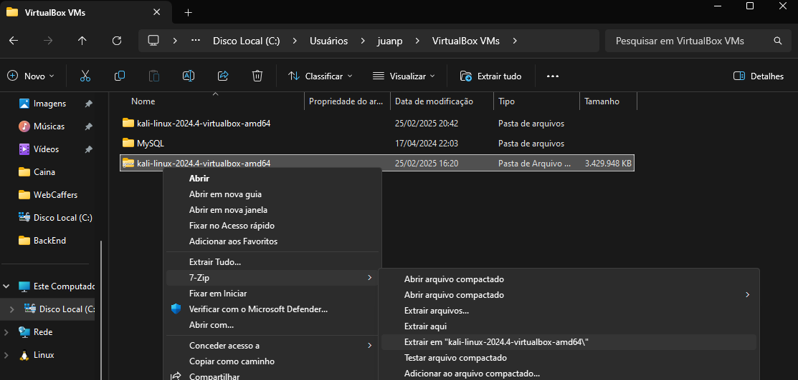
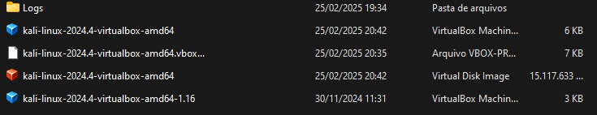

# 🖥️ Instalação do Kali Linux em Máquina Virtual

O **Kali Linux** é um sistema operacional baseado em Linux, focado totalmente em **hacking** e **penetration testing**. Ele reúne diversos frameworks de hacking em uma única distribuição Linux, já configurada para esse propósito.  

Durante o curso, será necessário utilizar o **Kali Linux**, mas **não** iremos instalá-lo diretamente no nosso computador. Em vez disso, usaremos uma **máquina virtual**.

## 📌 O que é uma Máquina Virtual?
Uma **máquina virtual (VM)** permite rodar um sistema operacional dentro de outro, sem afetar a instalação principal do computador. Para isso, utilizaremos o **VirtualBox**.

O **VirtualBox** é um software que virtualiza um computador dentro do nosso computador, possibilitando a instalação de sistemas operacionais sem alterar o sistema principal.

---

## 🛠️ Passo a Passo para Instalação

### 1️⃣ Instalar o VirtualBox  
Baixe e instale o VirtualBox no seu computador através do link abaixo:  
🔗 [Download VirtualBox](https://www.virtualbox.org/wiki/Downloads)

### 2️⃣ Baixar o Kali Linux  
Faça o download do Kali Linux pelo site oficial:  
🔗 [Download Kali Linux](https://www.kali.org/get-kali/#kali-platforms)

No site, siga os passos:  
1. Clique na opção **"Virtual Machines"**.  
2. Baixe a imagem já pronta do Kali Linux.  
3. Escolha a versão para **"VirtualBox"**.

📌 **Observação:**  Após a instalação do Kali Linux, precisamos descompactar o arquivo. KaliLinux vem compactado com a extensão 7z, então, utilizaremos o "winrar" ou "7zip"(ferramente open source) para fazer a extração.

- Movi o arquivo Kali Linux para dentro da pasta VM Box(Recomendado), e, posteriomente, extrai.

    

- Depois da extração, verá algo parecido com:

    

    
    > **Clique duas vezes em "kali-linux-2024.4-virtualbox-amd64"**

---

🔙 [Voltar para o índice](../../README.md)
🔙 [Voltar para WhatPentest.md](WhatPentest.md)