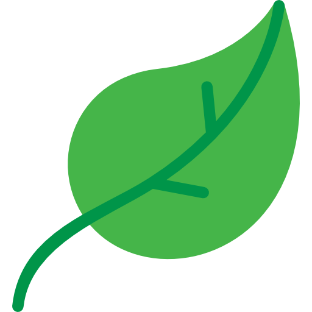

# 📌 **Meu Aprendizado em CyberSecurity**

Este repositório contém meus estudos sobre CyberSecurity. Clique em um dos tópicos abaixo para visualizar os conteúdos específicos de cada curso:

## 🔗 Cursos e Conteúdos

- [Solyd Offensive - O que é Pentest](Cursos/SolydOffensiveCyber/WhatPentest.md)
- [Solyd Offensive - Kali Linux](Cursos/SolydOffensiveCyber/KaliLinux.md)

###  Tópicos Rodney
-  [OWASP TOP 10 - O que é?](Cursos/Topicos_Rodney/OWASP_TOP10/1.OWASP.md)

---

